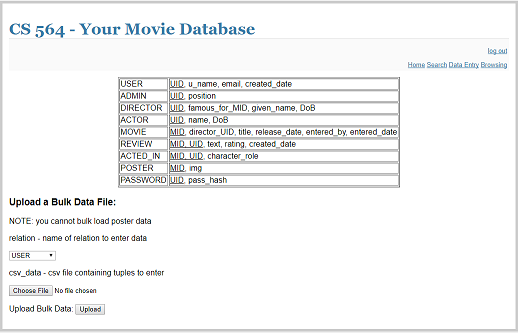

# CS 564 Project Stage 5
### WMDB - Web Movie Database
Authors: Joseph Eichenhofer, Yuqi Huang, Daniel Kazaniwskyj

# Running the Application

Ours is a flask web application deployed to google cloud platform. It can be accessed [here](http://35.224.121.2:5000). It should work with any web browser, but will likely not fit on mobile devices.

# RDBMS Choice

We followed the recommendation to create a Python Flask application using SQLite. The SQLite version running on our web server is 2.6.0 with the sqlite3 library for Python v3.6.

# Interfaces
Each interface is linked at the top of our web page. See the section on user authentication for which type of user has access to which interface. Every user will be able to access the search interface.

### Search
The search interface has the following three options:

### Data Entry
The data entry interface allows moderators and admins to enter data into the system. Each table has a form for entering data, with some including references to possible candidates for entry (e.g., UIDs are displayed for entering new admins). For each of the entry forms, you have to specify valid ids for foreign keys, otherwise the entry will fail. For bulk laoding, the data must be formatted as *tab* separated values, with exactly the correct heading names. We have provided sample files in the /bulk_data/ directory. If using these files to test the upload function, then you must enter them in the order they are presented (so that the IDs and foreign keys work correctly). The bulk uploads will fail if any constraints fail. When uploading a poster, the filetype must be correct. Uploading a malformed image has undefined behavior. Below are samples of the forms, other forms are similar.

### Browsing
The browsing interface displays the entries for each table (if allowed by the user authentication). Every user can browse the movie table, which also has links to movie detail pages (where reviews are also shown). Each table/relation has a display table. Below is a screenshot of the user table:

The following is an example of a movie detail page:

# Tables

### USER
This table contains an id, username, email, and creation date for each user in the database. The values in this table consist of three manually entered users (admin, mod, user), 1000 fake users/moderators generated by [fakenamegenerator.com](http://www.fakenamegenerator.com/order.php), and directors/actors taken from [The Movie DB](https://www.themoviedb.org) API. Note that a user can be a normal user, admin, director, actor, or any combination of them. It has approximately 42,600 entries.

### PASSWORD
This table stores hashed passwords for each user (that has created a password). As of now, only regular users and admins have passwords. The passwords for manually entered users is 123456789123 and the passwords for the fakenamegenerator entries are of the form uidLastname (e.g., 4Pedraza) and hashed using the bcrypt library. It has approximately 1,000 entries.

### ADMIN
This table stores admin roles for users that are either moderators or admins. Each tuple contains the UID and the admin position for that user. For example, the admin user with UID 1 has the entry (1, 'admin'). It has approximately 100 entries.

### DIRECTOR
This table has information for users who are directors. It contains the user's UID, an optional MID of the director's most popular movie, the director's name, and an optional timestamp for the director's date of birth. It has approximately 8,000 entries.

### ACTOR
This table has information for users who are actors. It has fields for the UID of the user, a stage name, a given name, and an optional timestamp for the actor's date of birth. It has approximately 35,000 entries.

### MOVIE
Contains information for the movies in this system. Each entry has an MID, the UID for this movie's director, the movie's title, a timestamp for its release date, the UID of the admin who entered the movie, and a timestamp for when the movie was entered. The table has approximately 18,900 entries.

### REVIEW
This table has the review information for users' reviews of movies. Each entry has the MID of a movie and the UID of a user reviewing it, as well as the timestamp of its creation, a 0 through 5 rating, and optional text. Only one review per user per movie is allowed (i.e., the primary key is (MID, UID)). It has approximately 4,000 entries.

### ACTED_IN
This table links actors with movies. It stores the MID of the movie, the UID of the actor in the movie, and the actor's role in that movie. The primary key is (MID, UID), so this table does not support actors playing more than one role in one movie. It has approximately 91,400 entries.

### POSTER
This table holds the link for a movie's poster (if the system has a poster for this movie). Each row has an MID, a filename for the poster, and the UID of the admin who entered it. The posters are stored in the /static/posters/ directory. This table has approximately 18,900 entries.

# Bonus Features

### Media Content
Our database stores movie posters! They can be seen in browsing the poster table and on each movie's info page. They can be uploaded via the data entry interface for the poster table, but not through bulk entry.

### Data
The following tables have over 10,000 tuples in them: USER, ACTOR, MOVIE, ACTED_IN, and POSTER.

### User Authentication and Authorization
Our system has three roles for accessing the data: public (not logged-in), user, moderator, and admin. We have created one of each user, with usernames of user, mod, and admin. Each has the same password of 123456789123.

| Role      | Permissions   |
| ---------:| ------------- |
| public    | browse movie table, search interface, see movie details            |
| user      | create reviews through movie detail pages                          |
| moderator | browse user, admin, director, actor, review, acted_in, and poster; data entry interface for director, actor, movie, review, acted_in, and poster |
| admin     | data entry interface for user and admin; bulk data entry interface |
